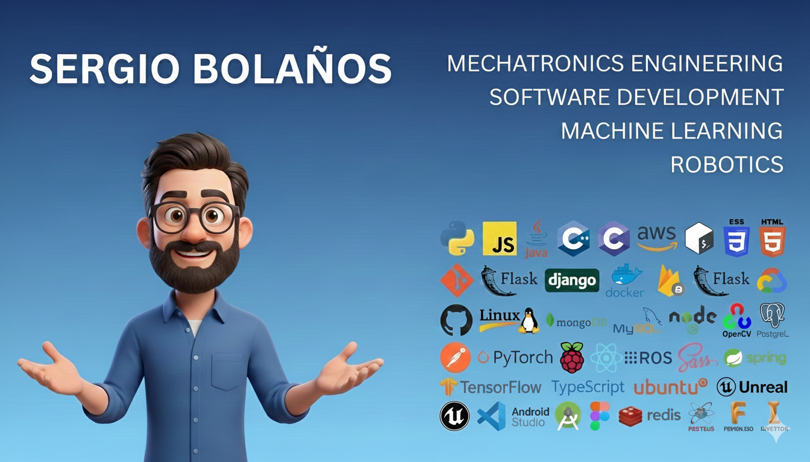

<h2 align="left">Hey there! I'm Sergio Bolaños</h2>

### 👨🏻‍💻 &nbsp;About Me
👨‍💻 &nbsp;I am currently freelance in Software Development and Machine Learning solutions. \
🎓 &nbsp;I am finishing my Mechatronics Engineering Degre at Universidad Nacional de Colombia. \
💡 &nbsp;I like to explore new technologies and develop software solutions and quick hacks.\
🌱 &nbsp;I'm on track for learning more about Robotics and Deep Learning.\
💬 &nbsp;Feel free to reach out to me for pro bono consulting and volunteering, or just for some interesting discussion.\
✉️ &nbsp;You can shoot me an email at sergioandresbolanospenagos@gmail.com! I'll try to respond as soon as I can.\
📄 &nbsp;Please have a look at my [Résumé](https://drive.google.com/file/d/1fP9axT2suExGKEZBUASddRBzhhIRhIc5/view?usp=sharing) for more details about me. I'm open to feedback and suggestions!

---

## 🛠 &nbsp;Tech Stack

### 👩‍💻 Languages

  

### 🌐 Frontend

  

### 🧩 Backend & APIs

  

### 🗃 Databases

  

### ☁️ Cloud & DevOps

  

### 🤖 AI / ML / Computer Vision

  

### 🤖 Robotics, Simulation & Offline Programming

  
  &nbsp;&nbsp;
  
  &nbsp;
  
  &nbsp;
  

### 🧱 CAD / CAM / CAE (Design & Manufacturing)

  
  &nbsp;
  
  &nbsp;
  

### 🏭 Industrial Automation / PLC

  
  
  &nbsp;

### ⚡ Electronics / Circuit Simulation

  
  &nbsp;
  
    &nbsp;
  

### 🧰 Tools

  
  &nbsp;&nbsp;
  

---

### ⚙️ &nbsp;GitHub Analytics

  
  

### 🤝🏻 &nbsp;Connect with Me

  
  

